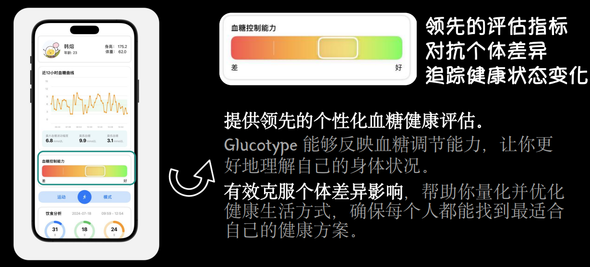
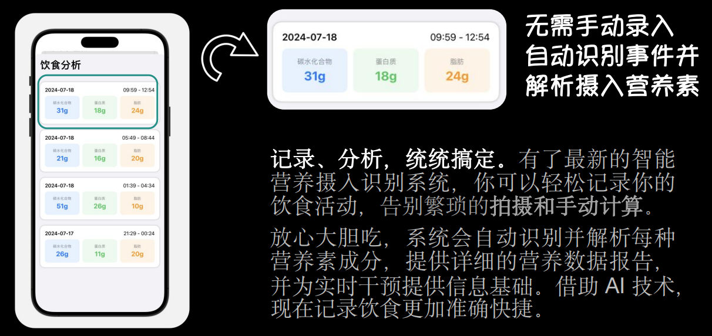
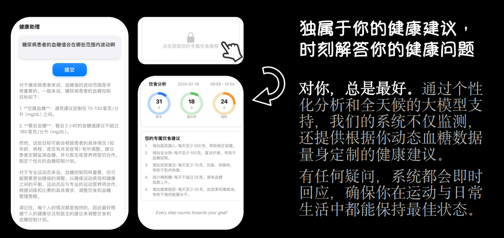
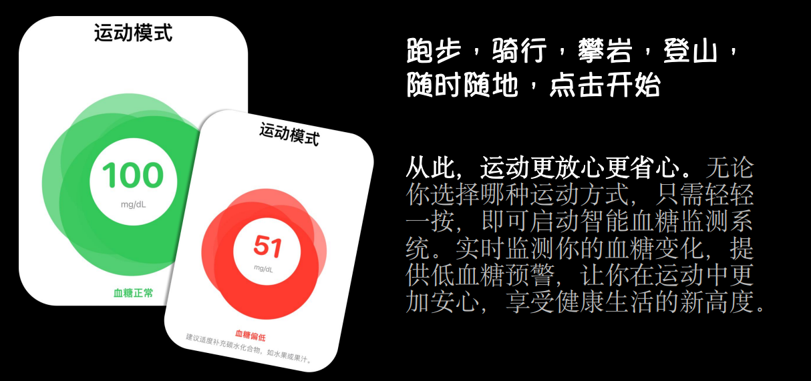

# **GlucoInsight 血糖慧测**

**告别手动记录，健康尽在掌握。**

> Build in AdventureX 2024。

### ‘**正常人’需要控糖吗?** 

“葡萄糖实实在在地影响着每一个人。包括我们的心情、睡眠、体重、皮肤、免疫系统健康，患心脏病的风险以及受孕的机会。此前一项研究表明，只有12% 的美国人的代谢是健康的，这意味着只有12%的美国人拥有完美运作的身体，包括拥有健康的血糖水平。**换言之，和我们最亲密的10个人中的9个人，可能都在不知不觉中坐上了“葡萄糖过山车”**。” 来源： “控糖革命 The Glucose Revolution” [法]杰西·安佐斯佩 著

为什么是‘血糖’，而不是‘卡路里’? 血糖水平的剧烈波动会导致能量水平的不稳定、情绪波动、饥饿感增加以及长期健康问题。平稳的血糖水平有助于保持稳定的能量和情绪，研究显示，关注血糖可以多方面提高健康水平。食物的质量比数量更重要。高质量的食物（如富含纤维的食物）有助于维持稳定的血糖水平，而不是单纯减少热量摄入。单纯关注卡路里更容易陷入节食焦虑。 来源： “控糖革命 The Glucose Revolution” [法]杰西·安佐斯佩 著

### **GlucoType 全新糖型检测，量化你的健康**

### **GlucoMeal ‘解放’饮食管理繁琐流程** 

### **GlucoAgent 比你还懂你身体的健康助理** 

### **GlucoSport 放肆运动 节奏不停** 

